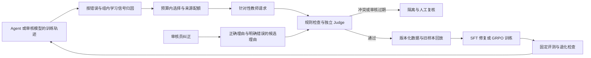

# 以学习瓶颈驱动的数据飞轮

本模块回答三个问题：下一批数据为什么值得做、它凭什么进入训练、回训之后有没有解决原来的问题。核心实现位于 `data_flywheel/`；通用方法和工程组合不作为原创算法声明。



## 1. 选择“可学”的错误，而不是只收集低分

`rl_feedback.py` 读取真实 Agent rollout，使用环境标签计算集合 F1，与奖励分别统计。数据据此分流：

| 观察 | 处理 |
|---|---|
| 全部正确且奖励相同 | 已掌握，进入少量回放 |
| 全部正确，但效率奖励不同 | 可做效率 RL |
| 诊断质量和奖励均有组内差异 | 可进入 GRPO |
| 诊断质量有差异，奖励却相同 | 先修奖励分辨能力 |
| 诊断质量相同，只有奖励变化 | 检查评分器偏差或辅助奖励投机 |
| 稳定做错且没有可用差异 | 教师纠正或 SFT 冷启动 |

```bash
python -m data_flywheel.rl_feedback /path/to/agent/trajectories.jsonl --output runs/routes.jsonl
```

`selection.py` 在预算内按错误代价、不确定性、教师分歧与预计处理成本排序，并限制同一来源组的数量。权重是可解释的启发式；其收益需要与随机采样和仅按低分采样做对照。

## 2. 审核反馈形成可靠的正负对

`feedback.py` 把审核员补写的正确理由作为 chosen；只有明确标注为 incorrect 的候选才能作为 rejected。未选中、同义表达或另一条同样正确的理由不会自动变成负例。

每条偏好对保留审核员、规则版本和原反馈 ID，可用于偏好学习，或在区域关联确认后用于视觉难负例训练。单纯拥有理由文本不代表已经完成区域定位。

## 3. 教师提供候选，规则和 Judge 决定去向

`teacher.py` 按漏检、误报、解释错误、工具错误等生成不同请求。真实服务接口支持图片输入，要求引用可见证据，并允许“不足以判断”。当前端到端 demo 使用渲染器真值和显式测试审核记录；没有伪装成调用了大教师。

`curation.py` 将审核绑定到候选内容哈希：标签、图像路径或规则版本改变后，旧审核不能继续使用。教师不能以同一标识审核自己的输出；规则与 Judge 冲突进入隔离区。不同模型名字也不保证错误独立，真实部署仍需抽检。

## 4. 防止评测回流和新数据淹没旧能力

检查样本 ID、来源组、图像内容哈希或 Agent 案例内容哈希。图像改名不能绕过检查；视频帧依赖正确的来源组标识隔离。当前未实现视觉近重复检索，不能保证发现所有裁剪或压缩变体。

`release.py` 生成只创建、不覆盖的数据版本、样本列表与 SHA-256，保留旧样本回放，并限制新样本占比。`round.py` 会核验实际文件/案例内容、检查旧数据与评测集重叠，同时输出接收、拒绝和隔离原因。独立规则结果与 Judge 决定均需绑定候选摘要。

审核任务使用 `image`、`image_sha256` 和结构化审核标签；Agent 任务使用 `task_type=agent`、`case`、`case_sha256` 和根因集合。案例隐藏状态继续只供环境使用，不能直接塞进模型提示词。

## 5. 用独立正确性决定是否接受新版本

`evaluation.py` 要求基线与新模型的样本 ID、标签和来源组配对一致，按来源组 bootstrap，报告总体差值、置信区间与分标签退化。奖励上涨本身不参与接受条件。这里的接受是“可进入人工审阅”，不会自动替换部署模型。

`agent_evaluation.py` 把真实Agent预测接入同一门槛：独立案例文件提供标签和来源组；预测必须完整配对、不能改写标签；另检查单/多根因准确率及工具错误。训练集拒绝使用，开发集即使分数提高也不能通过版本验收。

```bash
python -m data_flywheel.agent_evaluation --cases frozen/test.jsonl \
  --baseline baseline.jsonl --challenger challenger.jsonl --output gate.json
```

```bash
python -m scripts.run_flywheel_demo
```

该 demo 会接收 1 条正常增广、拒绝 1 条改名的评测图片、隔离 1 条标签修改后沿用旧审核的样本，并生成 1 条明确审核过的偏好对。数据版本含 4 条回放与 1 条新样本。这些是集成测试事实，不是业务质量收益。

## 待验证的研究问题

分流另检查奖励与独立正确性的成对排序：若更差答案得分反而更高，进入 `audit_reward_quality_conflict`，先修奖励再考虑RL。该规则比较已验证的质量分，不用模型自报信心替代正确性。它是保守启发式规则；质量标签本身错误仍会误导它。

对8组已有Agent真实轨迹重新审查，仍为3组可学习、3组仅辅助奖励变化、2组教师/SFT修复，没有新发现的排序倒置。配套[根因加权回训对照](https://github.com/WonderfulClaire/5G-Diagnostic-Agent/blob/main/reports/experiments/20260915-retention/REPORT.md)未解决旧能力退化，候选未采用，冻结测试保持封存。

固定总样本数、教师预算、训练步数和模型，比较随机回流、仅按低奖励回流、按学习信号分流。报告新错误修复率、旧类别退化、每条有效样本的生成/审核成本，以及独立评测。若质量不变，只是奖励或样本数量上升，则不接受新版本。
